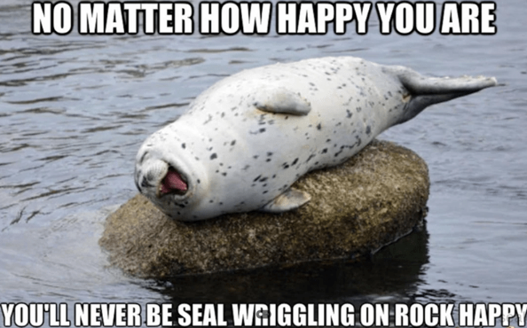

# data.table
Materials for our CMU Statistics & Data Science Statbytes Presentation: *Computational Efficiency of R's data.table package*

# Seal memes and data.table jokes :) 
Why did the data.frame break up with the data.table? It wanted a faster relationship! \
Why did the data.frame say to the data.table? You have the key to my heart! \
What is the seal’s favorite programming language? R-r-r! 

